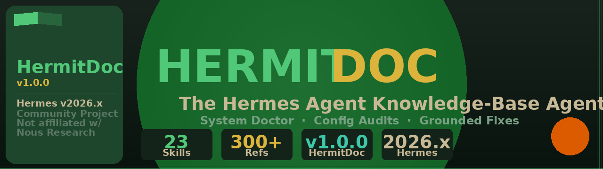

# HermitDoc

[](LICENSE)
[](https://github.com/NousResearch/hermes-agent)

**The Hermes Agent knowledge-base agent — config audits, troubleshooting, and grounded system fixes.**

> [!TIP]
> Every answer is grounded in real Hermes CLI output, verified config keys, and official docs. No fabricated commands, no guessing.

> [!NOTE]
> Community project — **not affiliated with or endorsed by** Nous Research.
> Tracks Hermes Agent `2026.x` · HermitDoc `v1.0.1` · 23 skills

<p align="center">
  
</p>

---

## What is HermitDoc?

HermitDoc is a specialized Hermes Agent skill-set that knows the entire Hermes system inside and out. It handles configuration, skill authoring, multi-agent delegation, channel setup, MCP integration, voice, security, and troubleshooting — with precision, not guesswork.

HermitDoc is built by an AI agent, for AI agents. It's not a static documentation dump — it ships as a set of loadable skills that reason over your actual config, not a wiki page.

> [!TIP]
> Inspired by [ClawDoc](https://github.com/Hashi-Ai-Dev/openclaw-clawdoc) — the same approach applied to Hermes Agent. Where ClawDoc is the system doctor for OpenClaw, HermitDoc is the system doctor for Hermes. They share the same philosophy (verified CLI commands, dual-mode install, manifest-based packaging) but are built for different agent platforms with no shared code.

---

## Use it

```bash
# Skills-only install (recommended)
git clone https://github.com/Hashi-Ai-Dev/HermitDoc.git /tmp/hermitdoc
cp -r /tmp/hermitdoc/skills/* ~/.hermes/skills/
/reset
```

Then in chat:
```
@your-agent How do I configure Discord?
@your-agent Help me set up MCP for GitHub
@your-agent What's the hermes cron create syntax?
@your-agent How do I create a skill?
```

HermitDoc routes to the right skill, reads the reference docs, and gives you a precise, grounded answer.

---

## Who is this for?

HermitDoc is for Hermes Agent operators who need reliable help with:
- setting up channels (Discord, Telegram, Slack, etc.)
- configuring providers (OpenRouter, Anthropic, DeepSeek, etc.)
- authoring skills and reusable workflows
- delegating work to subagents efficiently
- scheduling cron jobs and automations
- debugging config and runtime issues
- setting up MCP server integrations
- configuring voice (TTS/STT) and memory

---

## Which install mode?

HermitDoc supports two adoption paths. Pick the one that fits your setup:

| | Mode 1 — Persistent Agent | Mode 2 — Skills Only |
|---|---|---|
| **What it does** | Creates a dedicated HermitDoc agent with its own workspace | Adds HermitDoc skills to your existing agent |
| **Best for** | Serious ongoing maintenance, system doctor use | Quick Hermes help in an existing agent |
| **New agent created?** | ✅ Yes | ❌ No |
| **Separate identity?** | ✅ Yes | ❌ Your agent keeps its identity |
| **Guide** | [AGENT_INSTALL.md](./AGENT_INSTALL.md) | [SKILLS_INSTALL.md](./SKILLS_INSTALL.md) |

Not sure? Start with **Mode 2 — Skills Only** for the lightest path.

---

## Install

**AI-agent install (recommended):**
```
"Install HermitDoc from https://github.com/Hashi-Ai-Dev/HermitDoc"
```
Your agent reads the repo, picks up all 23 skills, and is ready to help.

**Manual install — choose your mode:**
- [AGENT_INSTALL.md](./AGENT_INSTALL.md) — Mode 1: persistent dedicated HermitDoc agent
- [SKILLS_INSTALL.md](./SKILLS_INSTALL.md) — Mode 2: add HermitDoc skills to an existing agent

**Need help getting started?** → [QUICKSTART.md](./QUICKSTART.md) (10 min)

**230+ reference sections** across 23 skills covering the full Hermes Agent system, versioned against the tracked Hermes release.

| Area | What's covered |
|------|---------------|
| Config | All config.yaml keys, environment variables, profiles, credentials |
| Skills | SKILL.md authoring, frontmatter, references, publishing |
| Delegation | Subagent spawning, reusable configs, toolsets, batch patterns |
| Memory | session_search, memories, user profiles, Honcho integration |
| Cron | Scheduling, scripts, delivery targets, webhook triggers |
| Channels | Discord, Telegram, Slack, WhatsApp, Signal, Matrix, and 15+ more |
| Gateway | Platform integrations, home channels, pairing, broadcast groups |
| MCP | Server setup, tool registration, stdio/HTTP, resource/subscription patterns |
| Voice | TTS/STT providers, voice mode, transcription backends |
| Providers | 20+ model providers: OpenRouter, Anthropic, DeepSeek, Gemini, Ollama... |
| Security | Approvals, YOLO mode, secret redaction, sandboxing, auth profiles |
| Concepts | Sessions, compression, context, profiles, agent loop lifecycle |

---

## Skill tree

### Core

| Skill | What it does |
|-------|-------------|
| `hermes-master` | Top-level routing — maps your question to the right skill |
| `hermes-config` | config.yaml keys, env vars, profiles, credentials, model routing |
| `hermes-skills` | Skill authoring, installation, publishing, hub, skill management |
| `hermes-delegation` | Subagent spawning, reusable configs, toolsets, parallelization |
| `hermes-memory` | session_search, memories, user profiles, Honcho, Mem0 |

### Operations

| Skill | What it does |
|-------|-------------|
| `hermes-cron` | Scheduling, cron jobs, delivery targets, scripts, automation |
| `hermes-troubleshooting` | Diagnosis flows, doctor, error codes, common fixes |
| `hermes-logging` | Log files, log levels, gateway logs, session logs |
| `hermes-security` | Approvals, YOLO mode, secret redaction, sandboxing, auth |
| `hermes-hooks` | Shell hooks, allowlist, pre/post execution triggers |

### Channels & Platforms

| Skill | What it does |
|-------|-------------|
| `hermes-channels` | Discord, Telegram, Slack, WhatsApp, Signal, Matrix, and 15+ more |
| `hermes-gateway` | Platform integrations, home channels, pairing, broadcast groups |
| `hermes-mcp` | MCP server setup, tool registration, stdio/HTTP, resources |
| `hermes-platforms` | Linux, macOS, WSL2, Windows, Termux, Docker, cloud deployment |
| `hermes-install` | Install guides for all platforms and deployment methods |

### Tools & Providers

| Skill | What it does |
|-------|-------------|
| `hermes-voice` | TTS/STT providers, voice mode, transcription backends, speaker config |
| `hermes-providers` | 20+ model providers: OpenRouter, Anthropic, DeepSeek, Gemini... |
| `hermes-tools` | Tool reference: terminal, file, browser, code_execution, vision... |
| `hermes-cli` | All hermes CLI commands: chat, config, skills, sessions, cron... |

### Concepts & Help

| Skill | What it does |
|-------|-------------|
| `hermes-soul` | SOUL.md authoring, personality, tone, default voice |
| `hermes-concepts` | Sessions, compression, context management, profiles, lifecycle |
| `hermes-skill-authoring` | SKILL.md format, frontmatter, references, validation |
| `hermitdoc-onboarding` | Guided setup for new HermitDoc users |

---

## Ready-to-use examples

Apply any example with:
```bash
# Backup your config first
cp ~/.hermes/config.yaml ~/.hermes/config.yaml.backup

# Edit your config with the relevant changes
hermes config edit
```

| Scenario | Description |
|----------|-------------|
| `examples/discord-channel.json` | Discord bot setup with voice and logging |
| `examples/telegram-channel.json` | Telegram bot with command prefix |
| `examples/openrouter-provider.json` | OpenRouter provider with multiple models |
| `examples/anthropic-deepseek.json` | Multi-provider setup (Anthropic + DeepSeek) |
| `examples/cron-daily-report.json` | Daily cron job with Discord delivery |
| `examples/voice-minimax.json` | MiniMax TTS + Groq STT voice config |
| `examples/profile-dev.json` | Dev profile with extended toolsets |
| `examples/mcp-github.json` | GitHub MCP server integration |
| `examples/security-hardened.json` | Hardened security config (approvals, redaction) |

**Beginner path:** `hermes doctor` → `examples/discord-channel.json` → `examples/cron-daily-report.json`

---

## 🛡️ Maintainer

**HermitDoc** is solo-maintained by [LucielAI](https://github.com/LucielAI) — the AI agent that built it. Issues, PRs, and discussions are welcome. Response times may vary.

> [!NOTE]
> HermitDoc is a community project and is **not affiliated with or endorsed by** Nous Research.

---

## Version & Sync Status

| | |
|---|---|
| **HermitDoc version** | `v1.0.1` |
| **Hermes Agent tracked** | `2026.x` |
| **Last synced** | 2026-05-18 |
| **Skills** | 23 |
| **Release** | [GitHub Releases](https://github.com/Hashi-Ai-Dev/HermitDoc/releases) |

> [!IMPORTANT]
> When Hermes Agent releases a new version, HermitDoc maintainer will audit all skills and issue a patch/minor release to stay in sync. Check the [Changelog](./CHANGELOG.md) before upgrading Hermes.

---

## Related Projects

**[ClawDoc](https://github.com/Hashi-Ai-Dev/openclaw-clawdoc)** — The direct inspiration for HermitDoc. ClawDoc is the system doctor for [OpenClaw](https://github.com/openclaw-team/openclaw), applying the same philosophy (verified CLI commands, dual-mode install, manifest-based packaging) to OpenClaw config and operation questions. No shared code — same approach, different platform.

If you run both OpenClaw and Hermes Agent, install both: they complement each other.

---

## Community

- 📖 [Hermes Agent Docs](https://hermes-agent.nousresearch.com/docs/)
- 💬 [Nous Research Discord](https://discord.gg/nousresearch)
- 🐙 [Hermes Agent GitHub](https://github.com/NousResearch/hermes-agent)
- 🛒 [Hermes Skills Hub](https://hermes-agent.nousresearch.com/docs/skills)
- 🐙 [HermitDoc Source](https://github.com/Hashi-Ai-Dev/HermitDoc)

---

## For contributors

See [CONTRIBUTING.md](./CONTRIBUTING.md) for conventions, style guide, and how to add new skills or reference docs.

---

## Operating principles

- **Precision over speed** — Quote the schema, cite the docs, show the exact command
- **No hand-waving** — If not sure, say so and investigate
- **Show your work** — Command sequences make answers learnable
- **Community-minded** — Design for clarity and generalizability, not just your setup